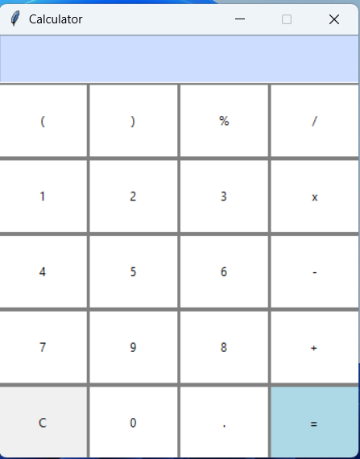

Python-GUI-Calculator 🧮

A simple calculator built using Python and Tkinter.

📌 Features

*Supports basic arithmetic operations: +, -, *, /, %

*Handles parentheses for complex calculations

*Decimal point support

*Clear button to reset calculations

*Simple and user-friendly GUI

*Lightweight and fast execution

*Error handling for invalid inputs

🚀 Installation & Usage

Prerequisites

*Python 3.x (Make sure Python is installed on your system)

## Steps to Run the Calculator

1.Clone this repository:

git clone https://github.com/yourusername/calculator.git

2.Navigate to the project folder:

cd calculator

3.Run the Python script:

python calculator.py

## 📸 Screenshot  

🛠️ Technologies Used

1.Python

2.Tkinter (GUI Library)

📌 Future Enhancements

Add a dark mode theme

Implement scientific calculator functions

Improve UI design with modern styles

Add keyboard input support

📜 License

This project is licensed under the MIT License.
